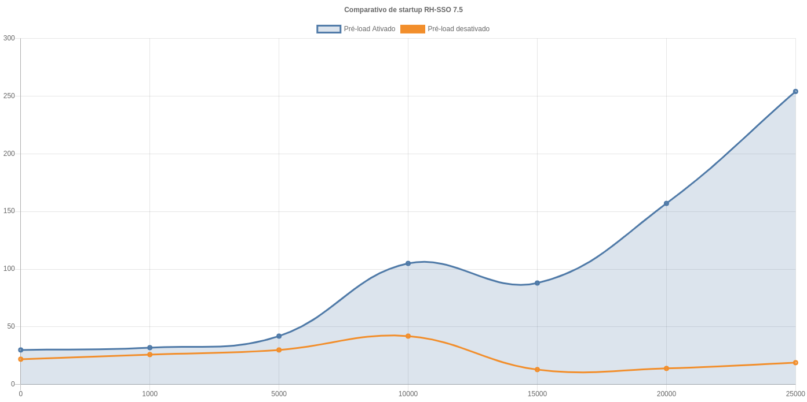

# Laboratório para testes de tokens offline 

O presente laboratório, tem por objetivo testar uma nova funcionalidade disponível na versão 7.5 do RH-SSO. 

A funcionalidade está presente no pull request https://github.com/keycloak/keycloak/pull/7722. A funcionalidade permite que o carregamento de tokens offline ocorra por demanda. Isso melhora substancialmente o tempo de startup do RH-SSO. Quando a sessão do token offline não é encontrada no infinispan, mas encontrada no banco de dados, o RH-SSO dinamicamente importa a sessão no cache.

## Preparando o ambiente

Para a configuração, do ambiente usado no laboratório efetuamos o download diretamente do site da RedHat da versão 7.5 do RH-SSO.

### Configurando RH-SSO
Para a funcionalidade ser ativada é necessária a execução das seguintes etapas no cli do jboss do RH-SSO:

```bash
/subsystem=keycloak-server/spi=userSessions:add()
/subsystem=keycloak-server/spi=userSessions/provider=infinispan:add(enabled=true)
/subsystem=keycloak-server/spi=userSessions/provider=infinispan:write-attribute(name=properties.preloadOfflineSessionsFromDatabase,value=${env.KEYCLOAK_INFINISPAN_SESSIONS_PRELOAD_DATABASE:false})
/subsystem=keycloak-server/spi=userSessions:write-attribute(name=default-provider,value=infinispan)
```
Os parametros do cli agora passam a observar a variável de ambiente `KEYCLOAK_INFINISPAN_SESSIONS_PRELOAD_DATABASE`, caso a variável não exista o valor default é false, que desliga o pré carregamento.

Com isso a funcionalidade de pré carregamento de sessões foi desabilitado.

### startup

O start-up é feito usando o comando: 
 ```bash
 rh-sso-7.5.0-server-dist/rh-sso-7.5/bin/standalone.sh
 ```

A inicialização do cli é feita pelo comando:
```bash
rh-sso-7.5.0-server-dist/rh-sso-7.5/bin/jboss-cli.sh
```

## Script de teste

Para gerar os tokens offline utilizamos o realm master com o client admin-cli. Previamente criamos o usuário administrativo usando a interface web. O usuário criado foi `admin` com a senha `admin`.

Para criar os tokens off-line usamos a ferramenta de execução de testes Hey que pode ser obtida em: https://github.com/rakyll/hey.

Abaixo temos o comando utilizado para gerar os tokens:

```bash
hey -n <NUM_REQUISICOES> -c <CONCORRENCIA> -m POST \
-d 'client_id=admin-cli&username=admin&password=admin&scope=offline_access&grant_type=password' \
-T 'application/x-www-form-urlencoded' \
'http://localhost:8080/auth/realms/master/protocol/openid-connect/token'
``` 


Os parametros `NUM_REQUISICOES` refere-se a quantidade de tokens que deve ser gerado, e o parametro `CONCORRENCIA` refere-se a quandos tokens serão gerados em paralelo.

Um comando equivalente o acima em bash puro seria o abaixo:

```bash
for i in {1..5000}
do
  echo $i
  curl --silent -d 'client_id=admin-cli' \
  -d 'username=admin' \
  -d 'password=admin' \
  -d 'scope=offline_access' \
  -d 'grant_type=password' \
  'http://localhost:8080/auth/realms/master/protocol/openid-connect/token' > /dev/null
done
```

## Comparativo de startup

Abaixo vemos um comparativo dos tempos de inicialização, o servidor utilizado Intel(R) Core(TM) i7-8650U CPU @ 1.90GHz com 8 processadores e 32 GB de RAM.

| Tokens offline  | start com pré-load  | start sem pré-load   | Diferença %
|---|---|---|---|
| 0  | 30 segundos | 22 segundos  | 36%  |
| 1000  | 32 segundos  | 26 segundos  | 23% |
| 5000  |  42 segundos  | 30 segundos  | 40% |
| 10000  | 1 min e 45 segundos  | 42 segundos  | 150%
| 15000  | 1 min e 28 segundos  | 13 segundos  | 576%
| 20000  | 2 min e 37 segundos  | 14 segundos  | 1021%
| 25000  | 4 min e 14 segundos  | 19 segundos  | 1236%



## Resultados Obtidos

Quando a quantidade de tokens offline são grandes demais o RH-SSO pode apresentar problemas na inicialização, por causa do tempo de transação para leitura e carga dos dados no cache infinispan.

Com a desativação do preload de usuários, obtivemos um um tempo praticamente constante no startup do RH-SSO, conforme demonstrado no gráfico acima.

